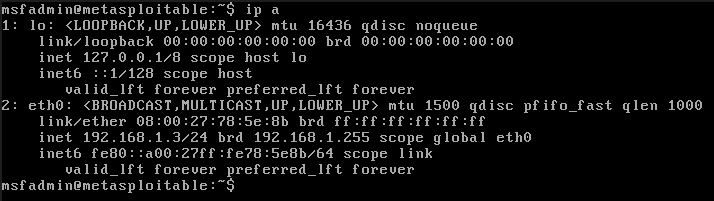
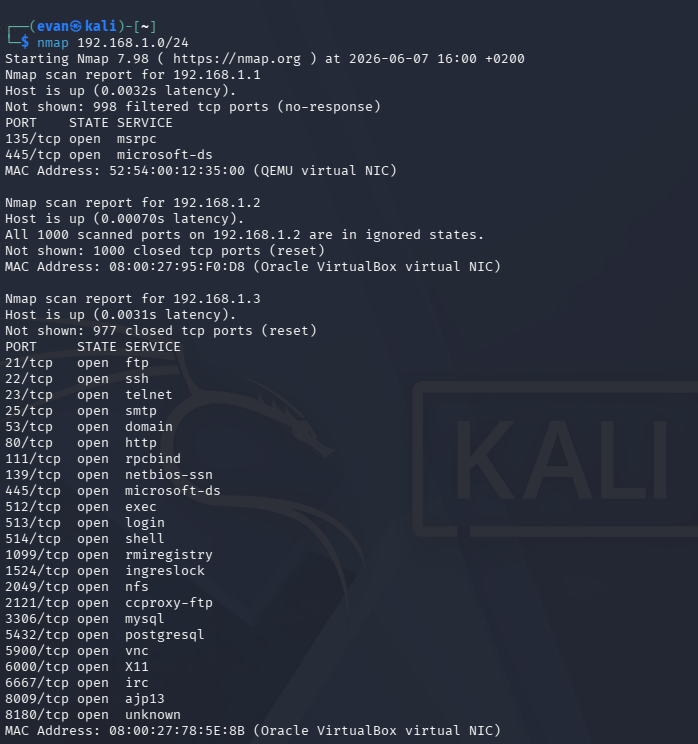
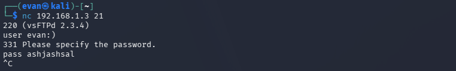
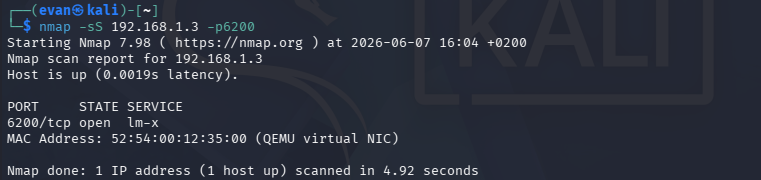
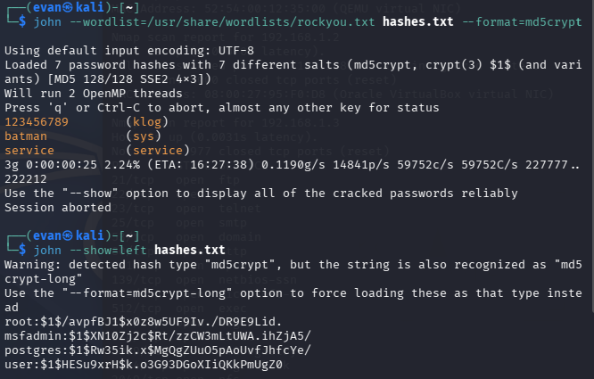
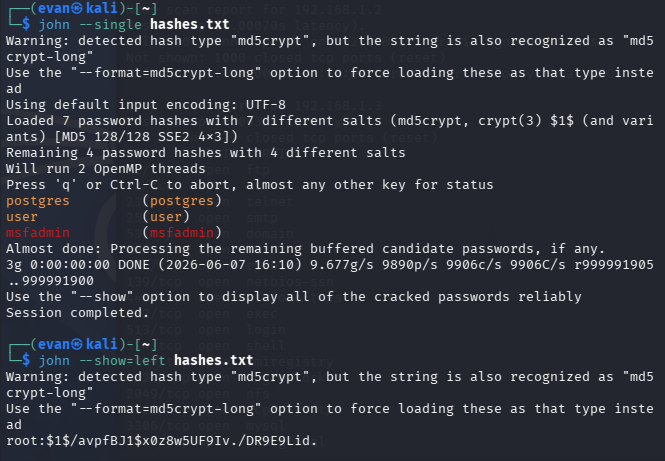
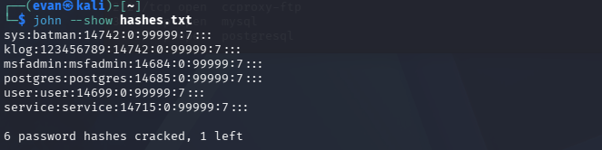

# "Vulnerability Assessment Report" - vsftpd Backdoor Exploitation
This document outlines the setup and execution of a demonstration showcasing a rudimentary example of a backdoor exploitation.

## Attack Summary
A penetration test was conducted against a target system running `vsftpd 2.3.4` to assess the impact of the known backdoor vulnerability (CVE-2011-2523). 
The assessment successfully demonstrated that an unauthenticated attacker can gain root-level access to the target system through the FTP service.

## Threat Model
The threat model for this attack assumes the adversary possesses the following capabilities:
* The attacker has access on the network to communicate with the vulnerable system
* The targeted machine has the 2.3.4 version of the vsftpd

## Demo Setup
To execute the Demo described below, we need two virtual machines configured as follows
* The attacker has a VM loaded with `Kali` Linux with `IPv4 192.168.1.4` and the `rockyou.txt` wordlist already extracted
* The target has a VM loaded with `Metasploitable 2` with `IPv4 192.168.1.3`

Both machines are in the same network (`192.168.1.0/24`) in order to communicate with each other. 

Metasploitable Configuration:

## Attack Flow

### Network Discovery 
The first attack step is to scan the entire subnetwork in order to identify the target system and confirm the presence of the vulnerable service. 
An nmap scan was used to find the defender IP and TCP ports open scanning the entire `/24` subnetwork. In the demo the TCP ports were already shown after the command but sometimes it is necessary to launch another nmap command specifying the right IP address of the target system.

### Backdoor Exploitation
A connection was established to the FTP service (running on port 21) using Netcat. The goal was to interact with the vsftpd server and deliver the malicious payload that would trigger the backdoor. 

Upon connection, the FTP banner was received, confirming that the service was responsive and ready to accept commands. The backdoor trigger was delivered by sending a specially crafted username to the FTP server. The vsftpd 2.3.4 backdoor activates when a username that ends with the sequence `:)` is submitted. While the username is the crucial part, the password field can contain any arbitrary value.

When the FTP server processes the username containing `:)`, the malicious code embedded in the vsftpd binary executes. This code binds a root-level command shell to TCP port 6200 on the target system, bypassing any authentication requirements.

A verification scan was performed by using the nmap command with the option `-sS` that will check if the port 6200 is opened but it won't connect to it, thus avoiding the risk of closing it.

A Netcat connection was established to port 6200, providing the attacker direct access to a root shell on the target system. After confirming that root priviledges are acquired the cat /etc/shadow command was performed in order to extract the password hashes from the system.

The /etc/shadow file was copied and saved for offline password cracking. The following user accounts with crackable hashes were identified: 

| Username | Hash Type | Hash Value                           | Crackable |
| -------- | --------- | ------------------------------------ | --------- |
| root     | MD5-crypt | `$1$/avpfBJ1$x0z8w5UF9Iv./DR9E9Lid.` | YES |
| sys      | MD5-crypt | `$1$fUX6BP0t$Miyc3Up0zQJqz4s5wFD9l0` | YES |
| klog     | MD5-crypt | `$1$fZ2VMS4K$R9XK1.CmLdHhduE3X9jqP0` | YES |
| msfadmin | MD5-crypt | `$1$XN10ZJ2c$Rt/zZcW3mLtUWA.iHzjA5/` | YES |
| postgres | MD5-crypt | `$1$Rw35ik.x$MgQqZUu05pAoUvfJhfCYe/` | YES |
| user     | MD5-crypt | `$1$HESu9xrH$k.o3G93DGoXIIqKKPmUgZ0` | YES |
| service  | MD5-crypt | `$1$kR3ue7JZ$7GxELDupr50hp6cjZ3Bu/`  | YES |

### Password Cracking
The extracted hashes were saved to a file and processed using John the Ripper. Multiple attack modes were employed to maximize success. 

The first mode used was to compare those hashes with the rockyou.txt wordlist already present in Kali. 

Not all the hashes were present in the selected wordlist so only three out of seven hashes were successfully cracked. Therefore, we attempted other modes. The `--single` option was used and successfully cracked three additional hashes.

The only remaining hash was for the root account. Its password was either non-trivial or not present in the wordlist, so it remained uncracked.

The final cracked results were:

## Conclusions 
This penetration test successfully demonstrated the critical severity of the vsftpd 2.3.4 backdoor vulnerability (CVE-2011-2523) against the Metasploitable 2 target. The attack was executed with minimal effort and no authentication, resulting in complete compromise of the target system. 

For the Metasploitable 2 environment specifically, the system is intentionally vulnerable for educational purposes. However, this assessment demonstrates real-world attack patterns that defenders must be prepared to detect and block.

## Credits
- **Video Reference:** Metasploit Hacking Demo (includes password cracking) by David Bombal https://www.youtube.com/watch?v=bBut8D7usKA&list=PL-9Wo53rJTQrWYLYaBvZA14FbE-GaFKjO)
- **Technical Guidance:** DeepSeek AI https://chat.deepseek.com
- **Markdown Template:** John Gruber found in Docsify-This https://daringfireball.net/projects/markdown/

The LLM provided technical guidance, command assistance, and report review. 

